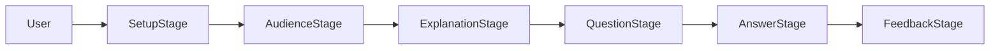

# Feynman Junior

Feynman Junior is a local-first learning assistant for practicing the
[Feynman Technique](https://en.wikipedia.org/wiki/Learning_by_teaching).
The app helps a learner explain a topic out loud to an audience-specific AI
persona, then uses a local Ollama model to respond with questions or feedback
at the selected audience level.

The current implementation is a React, TypeScript, and Electron desktop app in
[`my-app`](my-app). It combines a structured learning session, Ollama-backed
question and feedback generation, voice-first input with local transcription,
and a guided setup flow for the local AI services.

## Main Scope

The project focuses on one core learning loop:

1. The user chooses the audience they want to teach.
2. The app primes a local Ollama model to act like that audience.
3. The user records a spoken explanation, which is transcribed locally into an
   editable transcript.
4. The model generates audience-specific questions.
5. The learner answers the questions out loud (or by editing the transcript).
6. The model returns structured feedback, missing concepts, simplification tips,
   and next steps.

The intended product outcome is not a general chatbot. It is a focused
teaching-practice tool that helps users simplify ideas, identify unclear
assumptions, and refine their explanation for a specific audience.

## Current User Flow



On launch the app checks the local AI services. If Ollama is unreachable or the
configured model is missing, [`SetupStage`](my-app/src/components/workflow/SetupStage.tsx)
opens first: it shows live service status, lists installed models, downloads
the configured model with streamed progress, and configures the voice
transcription server. The status bar at the bottom of the window reflects both
services at all times, and Setup can be reopened from the title bar.

The app shell in [`my-app/src/App.tsx`](my-app/src/App.tsx) renders the active
workflow stage from [`my-app/src/state/useFeynmanSession.ts`](my-app/src/state/useFeynmanSession.ts):

- `selectAudience`: the learner chooses an audience.
- `primePersona`: the app checks Ollama and primes the audience persona.
- `submitExplanation`: the learner records a spoken explanation and edits the
  transcript.
- `generateQuestions`: Ollama returns structured questions.
- `reviewQuestions`: generated questions are shown as cards.
- `answerQuestions`: the learner records spoken answers to each question.
- `generateFeedback`: Ollama reviews the session.
- `reviewFeedback`: structured feedback and next steps are displayed.

Audience options and prompt builders are defined in
[`my-app/src/services/prompts.ts`](my-app/src/services/prompts.ts). Voice
capture and transcription are split between
[`my-app/src/components/input/VoiceRecorder.tsx`](my-app/src/components/input/VoiceRecorder.tsx)
(recording UI) and the transcription boundary described below.

## Architecture

```text
feynman-junior/
  README.md
  my-app/
    package.json
    electron/
      main.ts
      preload.ts
      config.ts
    src/
      App.tsx
      components/
        input/
          VoiceComposer.tsx
          VoiceRecorder.tsx
        workflow/
      config/
        ollama.ts
        transcription.ts
      desktop/
        api.ts
      services/
        ollamaService.ts
        ollamaSetupService.ts
        setupStatus.ts
        transcriptionService.ts
        prompts.ts
      state/
        useFeynmanSession.ts
      types/
        session.ts
```

### Desktop App

- Framework: React with TypeScript in an Electron renderer.
- Tooling: Vite and Electron Vite for renderer, main, and preload bundles.
- Window: a fixed, non-scrolling desktop shell. The title bar, progress rail,
  and status bar stay pinned; only the stage content pane scrolls internally.
- Entry point: [`my-app/src/index.tsx`](my-app/src/index.tsx).
- Electron main process: [`my-app/electron/main.ts`](my-app/electron/main.ts).
- Electron preload bridge: [`my-app/electron/preload.ts`](my-app/electron/preload.ts).
- App shell: [`my-app/src/App.tsx`](my-app/src/App.tsx).
- Workflow controller: [`my-app/src/state/useFeynmanSession.ts`](my-app/src/state/useFeynmanSession.ts).
- Domain types: [`my-app/src/types/session.ts`](my-app/src/types/session.ts).

### Ollama Integration

[`my-app/src/services/ollamaService.ts`](my-app/src/services/ollamaService.ts)
wraps LangChain's `ChatOllama` behind a typed service boundary. In Electron,
the renderer calls this through the preload API and main-process IPC instead of
using Node-capable dependencies directly.

Setup support lives in
[`my-app/src/services/ollamaSetupService.ts`](my-app/src/services/ollamaSetupService.ts)
(installed-model listing and streamed `/api/pull` downloads) and
[`my-app/src/services/setupStatus.ts`](my-app/src/services/setupStatus.ts)
(combined readiness checks used by both the Electron main process and the
browser dev mode).

Current defaults:

- Base URL: `http://localhost:11434`
- Model: `phi4-mini`
- Temperature: `0.3`
- Cache: enabled

Defaults are configured in [`my-app/src/config/ollama.ts`](my-app/src/config/ollama.ts),
persisted per-user from the Setup screen, and can be overridden with:

- `REACT_APP_OLLAMA_BASE_URL`
- `REACT_APP_OLLAMA_MODEL`
- `REACT_APP_OLLAMA_TEMPERATURE`
- `REACT_APP_OLLAMA_CACHE`

The service checks `/api/tags` before priming so the UI can distinguish Ollama
availability from a missing model. Question and feedback prompts request JSON,
which is parsed into the session types before reaching UI components.

### Voice Input And Transcription

Voice is the primary input. The learner records explanations and answers with
[`VoiceRecorder`](my-app/src/components/input/VoiceRecorder.tsx)
(`MediaRecorder` capture), and the audio is transcribed by the Electron main
process through
[`my-app/src/services/transcriptionService.ts`](my-app/src/services/transcriptionService.ts).
Transcripts land in editable text areas so recognition mistakes can be fixed
before submission; typing remains available as a fallback.

Transcription targets any local OpenAI-compatible speech-to-text server
(`POST /v1/audio/transcriptions`), such as
[Speaches](https://speaches.ai), faster-whisper-server, or LM Studio with a
Whisper model. Defaults live in
[`my-app/src/config/transcription.ts`](my-app/src/config/transcription.ts):

- `REACT_APP_TRANSCRIPTION_BASE_URL` (default `http://localhost:8000`)
- `REACT_APP_TRANSCRIPTION_MODEL` (default `whisper-1`)

Both values can also be changed from the Setup screen. The transcription
server is recommended but not required: without it the app stays usable by
typing into the transcript fields.

## Local Development

### Prerequisites

- Node.js and npm
- Ollama installed and running locally
- The `phi4-mini` model available in Ollama (the Setup screen can download it)
- Optional: a local OpenAI-compatible transcription server for voice input

### Setup

Clone the repository:

```sh
git clone https://github.com/ACED-HR2024/feynman-junior.git
cd feynman-junior
```

Install app dependencies from the app directory:

```sh
cd my-app
npm install
```

Start Ollama if it is not already running:

```sh
ollama serve
```

Start the desktop app:

```sh
npm start
```

The in-app Setup screen handles the rest: it verifies Ollama, downloads
`phi4-mini` if needed, and points the app at your transcription server.

Optional local configuration:

```sh
REACT_APP_OLLAMA_BASE_URL=http://localhost:11434
REACT_APP_OLLAMA_MODEL=phi4-mini
REACT_APP_OLLAMA_TEMPERATURE=0.3
REACT_APP_OLLAMA_CACHE=true
REACT_APP_TRANSCRIPTION_BASE_URL=http://localhost:8000
REACT_APP_TRANSCRIPTION_MODEL=whisper-1
```

## Available Scripts

Run these from [`my-app`](my-app):

- `npm start`: starts the Electron development app.
- `npm run web`: starts only the Vite renderer for browser UI iteration.
- `npm test`: runs the Vitest suite once.
- `npm run build`: builds Electron main, preload, and renderer bundles.
- `npm run package`: assembles a local packaged Electron app directory.

## Current Limitations

- The Ollama model must be downloaded before practice can start (Setup makes
  this one click, but it is still a large download).
- Voice transcription requires a separate local server; without one, input
  falls back to typing.
- Structured JSON output depends on the local model following prompt
  instructions.
- The app does not yet persist learning sessions across restarts.
- Model downloads and transcription accuracy depend on the chosen local models.

## V2 Feature Ideas

### Core Learning Flow

- Add per-question follow-up feedback instead of only final session feedback.
- Add difficulty controls for question depth and answer expectations.
- Let learners revise their explanation after feedback and compare versions.
- Add progress indicators for repeated practice sessions.

### Audience Customization

- Replace raw audience values with richer persona prompts.
- Add custom audience descriptions such as "a skeptical 10-year-old" or
  "a product manager with no science background."
- Allow switching audience during a session.
- Add audience-specific prompt templates that control tone, depth, and question
  style.

### Voice Experience

- Show live waveform or level feedback while recording.
- Add per-take transcript history with undo.
- Bundle or auto-start a local Whisper server so voice works out of the box.
- Add language selection for transcription.

### Ollama Reliability

- Stream model responses so feedback appears progressively.
- Recommend a starter model list in Setup with size and quality notes.
- Health-check the configured transcription model, not just the server.

### Session Experience

- Add a session history panel for explanations, generated questions, answers,
  and feedback.
- Store recent sessions in `localStorage`.
- Add copy or export options for questions and feedback.

### Assessment And Study Tools

- Score explanations on clarity, analogy quality, audience fit, and missing
  fundamentals.
- Generate flashcards or quiz questions from the user's explanation.
- Create a study guide from a transcript.
- Add "explain it simpler" and "explain it more technically" transformations.

### Product Polish

- Add onboarding that explains the Feynman Technique.
- Replace placeholder loading copy with audience-aware progress messages.
- Improve keyboard navigation, focus handling, and screen reader labels.
- Expand test coverage for app rendering, unhappy paths, and accessibility.
