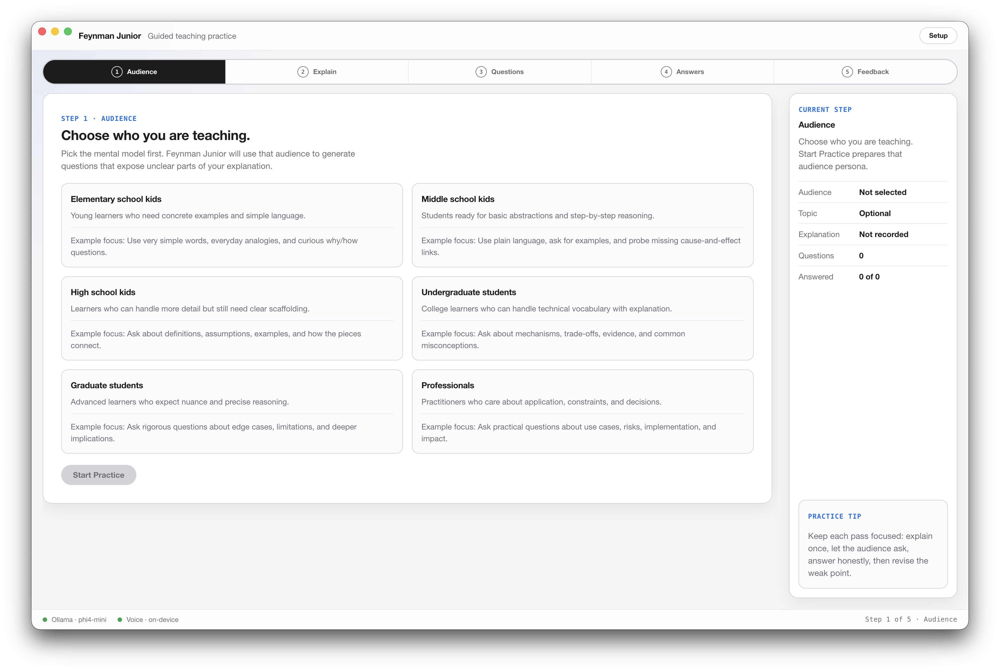

# Feynman Junior

A desktop app for practicing the [Feynman Technique](https://en.wikipedia.org/wiki/Learning_by_teaching).
Pick an audience, explain a topic out loud, and a local model asks you
questions and gives feedback at that audience's level. Everything runs on your
machine: Ollama for the language model, on-device speech-to-text for your
voice. Nothing leaves your computer.



## How it works

1. Choose who you're teaching, from elementary school kids to professionals.
2. Record your explanation. It's transcribed locally into an editable transcript.
3. The model plays that audience and asks questions about the unclear parts.
4. Answer out loud, then get feedback: what landed, what's missing, what to fix.

## How to run

You need Node.js and [Ollama](https://ollama.com/download).

```sh
ollama serve        # if Ollama isn't already running

cd my-app
npm install
npm start
```

On first launch a setup screen checks Ollama and downloads the default model
(`phi4-mini`) if it's missing. Voice needs no setup: the speech model
(MoonshineJS) downloads once on your first recording and runs offline after
that. You can always type instead of speaking.

## Notes

- The app is React + TypeScript + Electron, in [`my-app`](my-app).
- The Ollama model, server URL, and timeouts are configurable from the in-app
  Setup screen or with `REACT_APP_OLLAMA_*` environment variables.
- Speech-to-text runs in the renderer via MoonshineJS, so there is no second
  server to install or keep running.
- Scripts, configuration, and development details are in
  [`my-app/README.md`](my-app/README.md).
