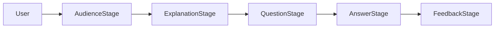

# Feynman Junior

Feynman Junior is a local-first learning assistant for practicing the
[Feynman Technique](https://en.wikipedia.org/wiki/Learning_by_teaching).
The app helps a learner explain a topic to an audience-specific AI persona,
then uses a local Ollama model to respond with questions or feedback at the
selected audience level.

The current implementation is a React and TypeScript web app in
[`my-app`](my-app). It combines a structured learning session, Ollama-backed
question and feedback generation, typed input, and browser speech recognition.

## Main Scope

The project focuses on one core learning loop:

1. The user chooses the audience they want to teach.
2. The app primes a local Ollama model to act like that audience.
3. The user submits a topic and explanation by typing or speaking.
4. The model generates audience-specific questions.
5. The learner answers the questions.
6. The model returns structured feedback, missing concepts, simplification tips,
   and next steps.

The intended product outcome is not a general chatbot. It is a focused
teaching-practice tool that helps users simplify ideas, identify unclear
assumptions, and refine their explanation for a specific audience.

## Current User Flow



The app shell in [`my-app/src/App.tsx`](my-app/src/App.tsx) renders the active
workflow stage from [`my-app/src/state/useFeynmanSession.ts`](my-app/src/state/useFeynmanSession.ts):

- `selectAudience`: the learner chooses an audience.
- `primePersona`: the app checks Ollama and primes the audience persona.
- `submitExplanation`: the learner submits topic and explanation text.
- `generateQuestions`: Ollama returns structured questions.
- `reviewQuestions`: generated questions are shown as cards.
- `answerQuestions`: the learner answers each generated question.
- `generateFeedback`: Ollama reviews the session.
- `reviewFeedback`: structured feedback and next steps are displayed.

Audience options and prompt builders are defined in
[`my-app/src/services/prompts.ts`](my-app/src/services/prompts.ts). Typed and
spoken input are split between
[`my-app/src/components/input/TextComposer.tsx`](my-app/src/components/input/TextComposer.tsx)
and [`my-app/src/components/input/SpeechRecorder.tsx`](my-app/src/components/input/SpeechRecorder.tsx).

## Architecture

```text
feynman-junior/
  README.md
  my-app/
    package.json
    public/
    src/
      App.tsx
      components/
        input/
        workflow/
      config/
        ollama.ts
      hooks/
        useSpeechRecognition.ts
      services/
        ollamaService.ts
        prompts.ts
      state/
        useFeynmanSession.ts
      types/
        session.ts
```

### Frontend

- Framework: React 18 with TypeScript.
- Tooling: Create React App through `react-scripts`.
- Styling: CSS files colocated with app and component code.
- Entry point: [`my-app/src/index.tsx`](my-app/src/index.tsx).
- App shell: [`my-app/src/App.tsx`](my-app/src/App.tsx).
- Workflow controller: [`my-app/src/state/useFeynmanSession.ts`](my-app/src/state/useFeynmanSession.ts).
- Domain types: [`my-app/src/types/session.ts`](my-app/src/types/session.ts).

### Ollama Integration

[`my-app/src/services/ollamaService.ts`](my-app/src/services/ollamaService.ts)
wraps LangChain's `ChatOllama` behind a typed service boundary.

Current defaults:

- Base URL: `http://localhost:11434`
- Model: `phi4-mini`
- Temperature: `0.3`
- Cache: enabled

Defaults are configured in [`my-app/src/config/ollama.ts`](my-app/src/config/ollama.ts)
and can be overridden with:

- `REACT_APP_OLLAMA_BASE_URL`
- `REACT_APP_OLLAMA_MODEL`
- `REACT_APP_OLLAMA_TEMPERATURE`
- `REACT_APP_OLLAMA_CACHE`

The service checks `/api/tags` before priming so the UI can distinguish Ollama
availability from a missing model. Question and feedback prompts request JSON,
which is parsed into the session types before reaching UI components.

### Speech Recognition

Speech input uses [`my-app/src/hooks/useSpeechRecognition.ts`](my-app/src/hooks/useSpeechRecognition.ts).
The hook checks both `SpeechRecognition` and `webkitSpeechRecognition`, exposes
support/error state, and preserves the final transcript after recording stops.
Unsupported browsers keep text input available and show a visible fallback.

## Local Development

### Prerequisites

- Node.js and npm
- Ollama installed and running locally
- The `phi4-mini` model available in Ollama
- A browser that supports `webkitSpeechRecognition` for microphone input

### Setup

Clone the repository:

```sh
git clone https://github.com/ACED-HR2024/feynman-junior.git
cd feynman-junior
```

Install app dependencies from the React app directory:

```sh
cd my-app
npm install
```

Install or pull the expected Ollama model:

```sh
ollama pull phi4-mini
```

Start Ollama if it is not already running:

```sh
ollama serve
```

In another terminal, start the React app:

```sh
cd my-app
npm start
```

Open [http://localhost:3000](http://localhost:3000).

Optional local configuration:

```sh
REACT_APP_OLLAMA_BASE_URL=http://localhost:11434
REACT_APP_OLLAMA_MODEL=phi4-mini
REACT_APP_OLLAMA_TEMPERATURE=0.3
REACT_APP_OLLAMA_CACHE=true
```

## Available Scripts

Run these from [`my-app`](my-app):

- `npm start`: starts the development server.
- `npm test`: starts the Create React App test runner.
- `npm run build`: creates a production build.
- `npm run eject`: ejects Create React App configuration. This is one-way and
  should be avoided unless the project intentionally moves away from CRA.

## Current Limitations

- The model must be available locally before the app can respond.
- Speech recognition is browser-dependent and not fully cross-browser.
- Structured JSON output depends on the local model following prompt
  instructions.
- The app is still client-only; sessions are not persisted across reloads.
- Styling is intentionally simple and needs product polish.

## V2 Feature Ideas

### Core Learning Flow

- Add per-question follow-up feedback instead of only final session feedback.
- Add difficulty controls for question depth and answer expectations.
- Let learners revise their explanation after feedback and compare versions.
- Add progress indicators for repeated practice sessions.

### Audience Customization

- Replace raw audience values with richer persona prompts.
- Add custom audience descriptions such as "a skeptical 10-year-old" or
  "a product manager with no science background."
- Allow switching audience during a session.
- Add audience-specific prompt templates that control tone, depth, and question
  style.

### Speech Experience

- Preserve transcript history after recording stops.
- Add explicit states for idle, listening, processing, success, and error.
- Show browser support messaging when speech recognition is unavailable.
- Add transcript reset, pause, and language controls.
- Add a Whisper-backed verbal answer mode so learners respond out loud before
  receiving feedback.

### Ollama Reliability

- Add a startup health check for Ollama and the configured model.
- Stream model responses so feedback appears progressively.
- Show actionable UI errors when Ollama is offline or the model is missing.
- Add an in-app settings panel for model, temperature, and base URL.

### Session Experience

- Add a session history panel for explanations, generated questions, answers,
  and feedback.
- Store recent sessions in `localStorage`.
- Add copy or export options for questions and feedback.

### Assessment And Study Tools

- Score explanations on clarity, analogy quality, audience fit, and missing
  fundamentals.
- Generate flashcards or quiz questions from the user's explanation.
- Create a study guide from a transcript.
- Add "explain it simpler" and "explain it more technically" transformations.

### Product Polish

- Add onboarding that explains the Feynman Technique.
- Replace placeholder loading copy with audience-aware progress messages.
- Improve keyboard navigation, focus handling, and screen reader labels.
- Expand test coverage for app rendering, unhappy paths, and accessibility.

## Suggested V2 Slice

The best first v2 implementation slice is a structured
"explain, generate questions, answer, get feedback" loop. It builds directly on
the existing audience selector, Ollama service, and text/speech input while
turning the current prototype into a more complete learning workflow.